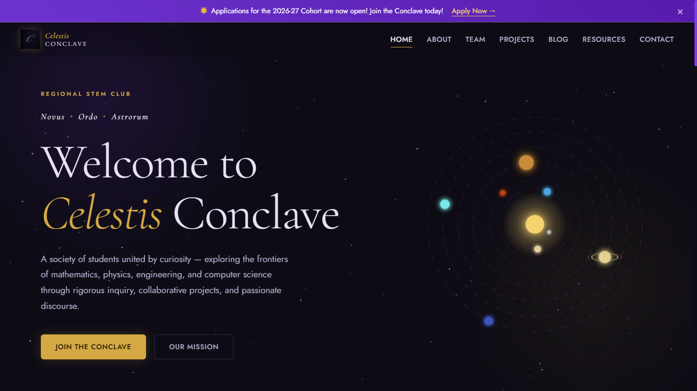

# Celestis Concalve

Showcase website for a regional STEM club.

## Live Website

[Visit Website](https://celestisconclave.github.io)

## Overview

This website serves as the showcase website for the Celestis Conclave regional STEM club. It serves as a showcase and archive of all projects, as well as articles written by members and recommended resources.

## Features

- Full admin CMS
- Markdown rendering for project and article pages
- Animated solar system hero element

## Technologies

- HTML
- CSS
- JavaScript

## Screenshots

## Future Improvements

- Possible UI refinements
- Potential forum feature

## Status

Complete

---

Created by [rishitc17](https://github.com/rishitc17)
